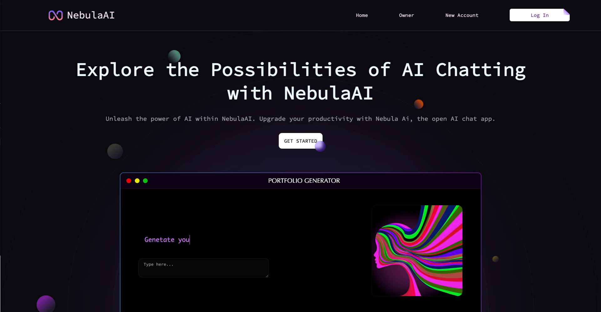
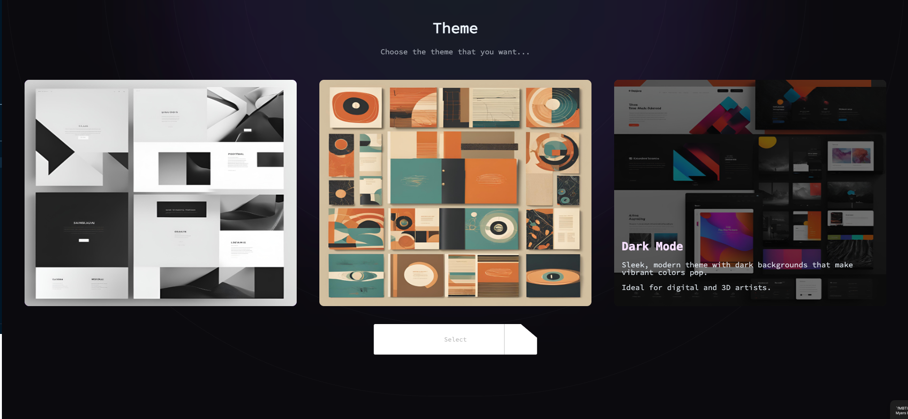

# Dynamic Portfolio Generator for Artists

## Overview

The Dynamic Portfolio Generator is an innovative web application designed to help artists create digital portfolios based on their unique style and preferred themes. This project combines the power of AI-generated art with user preferences to produce personalized digital art portfolios.

**Live Demo:** [http://51.20.55.249:3000/](http://51.20.55.249:3000/)

## Screenshots

### Home Page


This screenshot showcases the home page of our NebulaAI application. It features:
- A clean, modern design with a dark theme
- Navigation menu with Home, Owner, New Account, and SignIn options
- A prominent headline: "Explore the Possibilities of AI Chatting with Brainwave"
- A "GET STARTED" call-to-action button
- A preview of the Portfolio Generator feature

### Content Preview


This image provides a glimpse into the type of content our application can generate and interact with:
- Various video thumbnails showcasing different topics
- A coding tutorial for Flappy Bird using Java
- A "Group Study" image, possibly representing collaborative features
- A Minecraft-related content preview

These visuals demonstrate the versatility of our platform in handling different types of content and catering to various interests.

## Features

- **User Authentication:** Secure signup and login functionality using JWT (JSON Web Tokens).
- **Style Input:** Artists can describe their preferred style and themes.
- **AI-Generated Art:** Utilizes the Pixlr API to generate art pieces based on user descriptions.
- **Dynamic Portfolio View:** Users can view their generated portfolios in real-time.
- **Responsive Design:** A user-friendly interface that works across various devices.

## Technology Stack

- **Frontend:** React.js
- **Backend:** Node.js with Express.js
- **Database:** MongoDB
- **Authentication:** JSON Web Tokens (JWT)
- **API Integration:** Pixlr API for image generation
- **Deployment:** AWS (Amazon Web Services)

## Setup and Installation

### Prerequisites

- Node.js (v14 or later)
- npm (v6 or later)
- MongoDB account

### Local Development Setup

1. Clone the repository:
   ```
   git clone https://github.com/your-username/dynamic-portfolio-generator.git
   cd dynamic-portfolio-generator
   ```

2. Install dependencies:
   ```
   npm install
   ```

3. Set up environment variables:
   Create a `.env` file in the root directory and add the following:
   ```
   MONGODB_URI=your_mongodb_connection_string
   JWT_SECRET=your_jwt_secret_key
   PIXLR_API_KEY=your_pixlr_api_key
   ```

4. Start the development server:
   ```
   npm start
   ```

5. Open [http://localhost:3000](http://localhost:3000) to view the app in your browser.

## Deployment

The application is deployed on AWS. Here's an overview of the deployment process:

1. **EC2 Instance:** The application is hosted on an AWS EC2 instance.

2. **Domain and SSL:** We use a custom domain with SSL certification for secure access.

3. **Environment Setup:** Node.js and npm are installed on the EC2 instance.

4. **Application Deployment:**
   - Clone the repository on the EC2 instance.
   - Install dependencies using `npm install`.
   - Set up environment variables in a `.env` file.
   - Use PM2 or a similar process manager to keep the application running.

5. **Nginx Configuration:** Set up Nginx as a reverse proxy to handle incoming requests.

6. **SSL Certificate:** Use Let's Encrypt for free SSL certification.

7. **MongoDB Atlas:** The database is hosted on MongoDB Atlas for improved scalability and management.

## API Endpoints

- `POST /signup`: Register a new user
- `POST /login`: Authenticate a user and receive a JWT
- `GET /protected`: A protected route example (requires authentication)
- `GET /fetch-images`: Fetch AI-generated images based on user input

## Security Measures

- Passwords are hashed using bcrypt before storing in the database.
- JWTs are used for maintaining secure sessions.
- CORS is configured to accept requests only from the frontend origin.

## Future Enhancements

- Implement social login (Google, GitHub)
- Add more customization options for portfolio generation
- Introduce a gallery feature for users to showcase their best-generated works

## Contributing

Contributions are welcome! Please feel free to submit a Pull Request.

